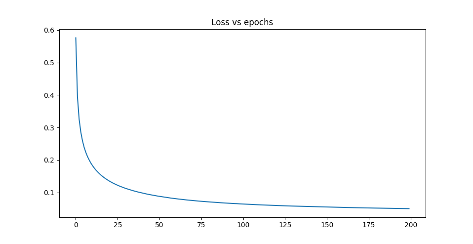
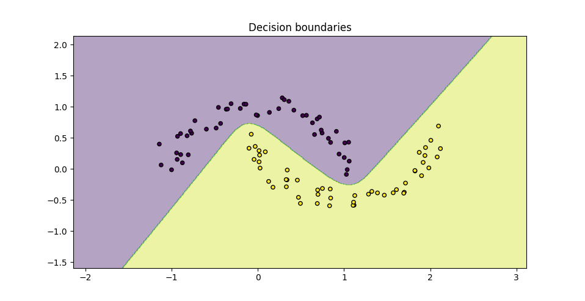

Neural-Nets
===========

A basic scikit-learn compatible NN library for Python 3, built from scratch
only using numpy.

Features
--------

- Arbitrary number of layers with arbitrary number of neurons
- Various activation functions (sigmoid, relu, tanh, linear)
- Gradient checking \o/
- Multiclass classification problems (cross entropy loss)
- Batch learning
- Regularization (2-norm)
- 'He' Initialization (works well with relu layers)
- SGD and adam solver

TODO:

- Dropout

MNIST example
-------------

Training a regularized NN with two RELU hidden layers with 100 neurons, batch
size 128 and 'He' initialization for 200 epochs *should* give you about 98%
accuracy on the MNIST dataset. (Could be much faster using adam instead of
SGD).

    $ python examples/mnist.py

The configuration of the neural net is done as follows:

```python
clf = NeuralNet(n_neurons=[X_train.shape[1], 100, 100, 10],
                activations='relu',
                n_epochs=200,
                batch_size=128,
                lambda_reg=.4,
                init_strat='He',
                solver='sgd',
                verbose=10)
```



Result:

```
Epoch     0, loss= 0.576
Epoch    10, loss= 0.183
Epoch    20, loss= 0.135
Epoch    30, loss= 0.112
Epoch    40, loss= 0.098
Epoch    50, loss= 0.088
Epoch    60, loss= 0.081
Epoch    70, loss= 0.075
Epoch    80, loss= 0.071
Epoch    90, loss= 0.067
Epoch   100, loss= 0.064
Epoch   110, loss= 0.062
Epoch   120, loss= 0.060
Epoch   130, loss= 0.058
Epoch   140, loss= 0.057
Epoch   150, loss= 0.055
Epoch   160, loss= 0.054
Epoch   170, loss= 0.053
Epoch   180, loss= 0.052
Epoch   190, loss= 0.051
Accuracy on trainset: 0.990
Accuracy on testset:  0.976
```

Moon example
-------------
    $ python examples/moons.py



See other examples in the `examples` directory.


Installation
------------

You'd be much happier with scikit-learn default implementation, BUT if you like
to live dangerously:

- First install scipy, numpy, matplotlib and scikit-learn (only used for
  dataset management). Can be done with

    ```
    $ pip install -r requirements.txt
    ```

- Then:

    ```
    $ python setup.py install
    ```

 
Documentation
-------------

Minimal doc of the NeuralNet class is available
[here](http://neural-nets.readthedocs.io).
